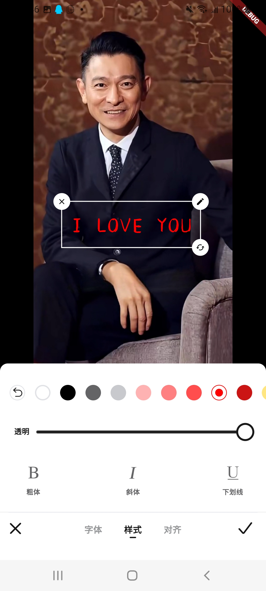
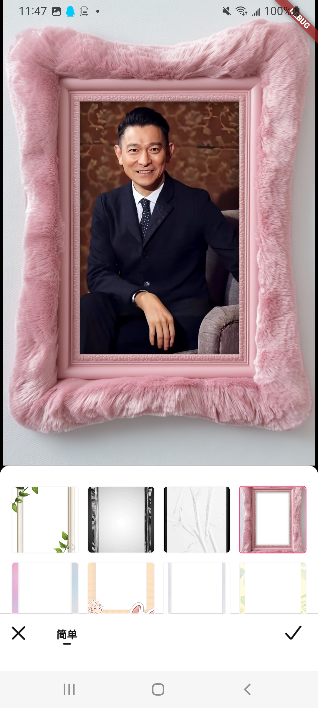

# **flu_editor**


`flu_editor` 是一个用于照片和视频的颜色滤镜编辑插件。

| 功能 | 状态  | 备注 |
|----|-----|----|
| 裁剪 | 已完成 |    |
| 颜色 | 已完成 |    |
| 滤镜 | 已完成 |    |
| 模糊 | 开发中 |    |
| 贴纸 | 已完成 |    |
| 文字 | 已完成 |    |
| 边框 | 已完成 |    |

## 入门

这是 Flutter 插件包的模板项目，其中包含 Android 和 iOS 的平台特定代码。

有关 Flutter 开发的详细信息，请参阅 [在线文档](https://docs.flutter.dev)，该文档提供了开发教程、示例、移动开发指南和完整的
API 参考。

## 功能概述

`flu_editor` 提供了多种图像编辑功能，以下是工具类的功能概述：

### EditorUtil 工具类

### 页面导航说明

- `goFluEditor`：跳转到编辑器页面。
- **参数说明**：
    - `context`：当前上下文，通常使用 `BuildContext` 来启动编辑器。
    - `orignal`：原始图片路径，用于传入需要编辑的图片。
    - `type`：编辑类型 （null 代表进首页）。
    - `singleEditorSave`：单独进到某个功能页面，关闭是否保存图片到相册。
    - `vipStatusCb`：一个回调函数，返回用户是否为 VIP 用户。
    - `vipActionCb`：一个回调函数，当用户非 VIP 时，触发跳转到订阅页面。
    - `saveCb`：一个回调函数，用于保存编辑后的图片，参数为保存路径。
    - `loadWidgetCb`：加载提示回调，用于显示加载动画，传入 `islight`（是否为浅色模式）、`size`
      （进度条大小）、`stroke`（进度条宽度）。
    - `toastActionCb`：一个回调函数，显示自定义提示信息（如 "保存成功"）。
    - `effectsCb`：回调函数，用于获取并处理滤镜配方。
    - `saveEffectCb`：回调函数，保存自定义滤镜配方。
    - `deleteEffectCb`：回调函数，删除已保存的滤镜配方。
    - `filtersCb`：回调函数，用于获取滤镜列表。
    - `stickersCb`：回调函数，用于获取贴纸列表。
    - `fontsCb`：回调函数，用于获取字体列表。
    - `framesCb`：回调函数，用于获取边框列表。
    - `closeEditorCb`：回调函数，编辑器关闭时触发，返回编辑后的图片路径。

- `内部页面路由`：
- **编辑器首页进入的具体功能区（宿主app不要直接调用，要通过goFluEditor(type)进入）。**：

    - `goCropPage`：跳转到裁剪页面。
    - `goColorsPage`：跳转到颜色调整页面。
    - `goFilterPage`：跳转到滤镜编辑页面。
    - `goStickerPage`：跳转到贴纸编辑页面。
    - `goFontPage`：跳转到字体编辑页面。
    - `goFramePage`：跳转到相框编辑页面。

## Screenshots

<table>
  <tr>
    <td>
      <a href="https://github.com/Andylove1314/flu_editors/blob/1.0.1-release/screenshots/Screen_Recording_20241127_115015%2012.10.21.gif">
        
      </a>
    </td>
    <td>
      <a href="https://github.com/Andylove1314/flu_editors/blob/1.0.1-release/screenshots/Screenshot_20241127-114447.jpg">
        
      </a>
    </td>
    <td>
      <a href="https://github.com/Andylove1314/flu_editors/blob/1.0.1-release/screenshots/Screenshot_20241127-165709.jpg">
        
      </a>
    </td>
  </tr>

  <tr>
    <td>
      <a href="https://github.com/Andylove1314/flu_editors/blob/1.0.1-release/screenshots/Screenshot_20241127-114514.jpg">
        
      </a>
    </td>
    <td>
      <a href="https://github.com/Andylove1314/flu_editors/blob/1.0.1-release/screenshots/Screenshot_20241127-114536.jpg">
        
      </a>
    </td>
    <td>
      <a href="https://github.com/Andylove1314/flu_editors/blob/1.0.1-release/screenshots/Screenshot_20241127-164212.jpg">
        
      </a>
    </td>
  </tr>

  <tr>
    <td>
      <a href="https://github.com/Andylove1314/flu_editors/blob/1.0.1-release/screenshots/Screenshot_20241127-114559.jpg">
        
      </a>
    </td>
    <td>
      <a href="https://github.com/Andylove1314/flu_editors/blob/1.0.1-release/screenshots/Screenshot_20241127-114641.jpg">
        
      </a>
    </td>
    <td>
      <a href="https://github.com/Andylove1314/flu_editors/blob/1.0.1-release/screenshots/Screenshot_20241127-114710.jpg">
        
      </a>
    </td>
  </tr>

</table>

## 使用示例

以下是如何使用 `flu_editor` 进行图像编辑的示例：

```dart

void main() {
  runApp(const MyApp());
}

class MyApp extends StatefulWidget {
  const MyApp({super.key});

  @override
  State<MyApp> createState() => _MyAppState();
}

class _MyAppState extends State<MyApp> {
  String _platformVersion = 'Unknown';
  final _fluEditorPlugin = FluEditor();

  /// 当前输入图
  String _currentImage = '';

  bool isVipUser = false;

  @override
  void initState() {
    super.initState();
    initPlatformState();
  }

  // Platform messages are asynchronous, so we initialize in an async method.
  Future<void> initPlatformState() async {
    String platformVersion;
    // Platform messages may fail, so we use a try/catch PlatformException.
    // We also handle the message potentially returning null.
    try {
      platformVersion = await _fluEditorPlugin.getPlatformVersion() ??
          'Unknown platform version';
    } on PlatformException {
      platformVersion = 'Failed to get platform version.';
    }

    // If the widget was removed from the tree while the asynchronous platform
    // message was in flight, we want to discard the reply rather than calling
    // setState to update our non-existent appearance.
    if (!mounted) return;

    setState(() {
      _platformVersion = platformVersion;
    });
  }

  @override
  Widget build(BuildContext context) {
    return MaterialApp(
      home: Builder(builder: (context) {
        return Scaffold(
          appBar: AppBar(
            title: const Center(
              child: Text('FluEditorApp'),
            ),
          ),
          body: Column(
            children: [
              Expanded(
                  child: Container(
                      width: double.infinity,
                      color: Colors.grey,
                      child: Stack(alignment: Alignment.center, children: [
                        _currentImage.isEmpty
                            ? const SizedBox()
                            : Image.file(File(_currentImage)),
                        GestureDetector(
                          onTap: () {
                            _pickImage(context);
                          },
                          child: Container(
                            height: 200,
                            width: 200,
                            color: Colors.white.withOpacity(0.4),
                            child: const Column(
                              mainAxisAlignment: MainAxisAlignment.center,
                              crossAxisAlignment: CrossAxisAlignment.center,
                              children: [
                                Icon(
                                  Icons.add_a_photo,
                                  size: 50.0,
                                ),
                                SizedBox(
                                  height: 20,
                                ),
                                Text(
                                  '添加照片',
                                  style: TextStyle(
                                      color: Colors.black, fontSize: 24),
                                ),
                              ],
                            ),
                          ),
                        ),
                      ]))),
              const SizedBox(
                height: 20,
              ),
              Material(
                child: SizedBox(
                  width: 200,
                  child: FilledButton(
                      onPressed: () async {
                        if (_currentImage.isEmpty) {
                          ScaffoldMessenger.of(context).showSnackBar(
                              const SnackBar(content: Text('请选择图片！')));
                          return;
                        }
                        _goEditor(context);
                      },
                      child: const Text('编辑照片')),
                ),
              ),
              const SizedBox(
                height: 40,
              ),
            ],
          ),
        );
      }),
    );
  }

  Future<void> _pickImage(BuildContext context) async {
    ImagePicker picker = ImagePicker();
    final XFile? image = await picker.pickImage(source: ImageSource.gallery);

    if (image == null) {
      return;
    }

    _currentImage = image?.path ?? '';
    setState(() {});
  }

  Future<void> _goEditor(BuildContext context) async {
    EditorUtil.goFluEditor(context,
        orignal: _currentImage,
        vipStatusCb: () {
          debugPrint('get vip status: $isVipUser');
          return isVipUser;
        },
        vipActionCb: () {
          debugPrint('go Sub');
          Navigator.of(context).push(MaterialPageRoute(
            builder: (context) {
              return const RoutePage();
            },
          ));
        },
        saveCb: (path) {
          GallerySaver.saveImage(path, albumName: 'Flu-Editor');
          ScaffoldMessenger.of(context)
              .showSnackBar(SnackBar(content: Text('保存成功: $path')));
        },
        loadWidgetCb: (islight, size, stroke) =>
            Container(
              width: size,
              height: size,
              alignment: Alignment.center,
              child: CircularProgressIndicator(
                color: islight ? Colors.white : Colors.black,
                strokeWidth: stroke,
              ),
            ),
        toastActionCb: (msg) =>
            ScaffoldMessenger.of(context)
                .showSnackBar(SnackBar(content: Text(msg))),
        effectsCb: (page) async => await _fetchPF(),
        saveEffectCb: (effect) async {
          debugPrint('保存配方：${effect.toJson()}');
          return await true;
        },
        deleteEffectCb: (id) async {
          debugPrint('删除配方：$id');
          return await true;
        },
        filtersCb: () => _fetchLJ(),
        stickersCb: () => _fetchStickers(),
        fontsCb: () => _fetchFonts(),
        framesCb: () => _fetchFrames(),
        closeEditorCb: (after) => debugPrint('last image = $after'));
  }

  Future<List<EffectData>> _fetchPF() async {
    return await [
      EffectData.fromJson({
        'name': 'test',
        'image':
        'https://nwdnui.oss-cn-beijing.aliyuncs.com/user/effectSave/da2752d15d0e48359bbc42c7ec845d3d/1730962077026793.jpg',
        'id': 0,
        'params': jsonEncode({
          "Brightness": 0.14719999999999997,
          "Saturation": 1.0,
          "Contrast": 1.0,
          "Sharpen": 0.0,
          "Shadow": 0.0,
          "Temperature": 0.0,
          "Noise": 0.0,
          "Exposure": 0.0,
          "Vibrance": 0.0,
          "Highlight": 0.0,
          "Red": 1.0,
          "Green": 1.0,
          "Blue": 1.0,
          "CenterX": 0.5,
          "CenterY": 0.5,
          "Start": 1.0,
          "End": 1.0
        })
      })
    ];
  }

  Future<List<FilterData>> _fetchLJ() async {
    FilterDetail detail1 = FilterDetail();
    detail1.id = 1;
    detail1.image =
    'https://nwdnui.bigwinepot.com/ui/index/icon/90ad4f7bbd3243c285d4f8aaff5123be.jpg';
    detail1.filterImage = 'luts/01-x.png';
    detail1.name = '滤镜1';
    detail1.noise = 0.2;
    detail1.vip = 1;
    detail1.lutFrom = 0;

    FilterDetail detail2 = FilterDetail();
    detail2.id = 2;
    detail2.image =
    'https://nwdnui.bigwinepot.com/ui/index/icon/90ad4f7bbd3243c285d4f8aaff5123be.jpg';
    detail2.filterImage = 'luts/03-x.png';
    detail2.name = '滤镜2';
    detail2.lutFrom = 0;

    FilterData group1 = FilterData();
    group1.groupName = '分类1';

    group1.list = [detail1, detail2];

    return [group1];
  }

  Future<List<StickerData>> _fetchStickers() async {
    StickDetail detail1 = StickDetail();
    detail1.id = 1;
    detail1.image =
    'https://nwdnui.bigwinepot.com/ui/index/icon/e71b319ebce14952a87a40a03f8e7404.png';
    detail1.name = 'sticker1';
    detail1.vip = 0;

    StickDetail detail2 = StickDetail();
    detail2.id = 1;
    detail2.image =
    'https://nwdnui.bigwinepot.com/ui/index/icon/1f0ceb1952a44a4ebd0a8c419a105545.png';
    detail2.name = 'sticker2';
    detail2.vip = 0;

    StickerData group1 = StickerData();
    group1.groupName = '分类1';
    group1.groupImage =
    'https://nwdnui.bigwinepot.com/ui/index/icon/318fa7a144af47f29adbdc73cb7e78b5.png';

    group1.list = [detail1, detail2];

    return [group1];
  }

  Future<List<FontsData>> _fetchFonts() async {
    FontDetail detail1 = FontDetail();
    detail1.id = 1;
    detail1.image =
    'https://nwdnui.bigwinepot.com/ui/index/icon/ca9f5c3e742d49c2bafa28c8808a2280.jpg';
    detail1.file =
    'https://nwdnui.bigwinepot.com/ui/index/icon/7be3f3395e5c49b3aec36071c9bacc03.ttf';
    detail1.name = 'font1';
    detail1.vip = 0;

    FontDetail detail2 = FontDetail();
    detail2.id = 2;
    detail2.image =
    'https://nwdnui.bigwinepot.com/ui/index/icon/8a2058f31d384c0d952f21661b8f4a3e.jpg';
    detail2.file =
    'https://nwdnui.bigwinepot.com/ui/index/icon/f5d6dbf7914d45eababc0cd395b973ed.ttf';
    detail2.name = 'font2';
    detail2.vip = 0;

    FontsData group1 = FontsData();
    group1.groupName = '简体';

    group1.list = [detail1, detail2];

    return [group1];
  }

  Future<List<FrameData>> _fetchFrames() async {
    FrameDetail detail1 = FrameDetail();
    detail1.id = 1;
    detail1.image =
    'https://nwdnui.bigwinepot.com/ui/index/icon/6c923546f7ff46d9bf613808b9bce72d.png';
    detail1.name = 'frame1';
    detail1.vip = 0;
    FrameSize size = FrameSize();
    size.frameWidth = 560;
    size.frameHeight = 1000;
    size.frameLeft = 94.0;
    size.frameTop = 142.0;
    size.frameRight = 88.0;
    size.frameBottom = 114.0;
    detail1.params = size;

    FrameDetail detail2 = FrameDetail();
    detail2.id = 2;
    detail2.image =
    'https://nwdnui.bigwinepot.com/ui/index/icon/e0ee85fe76e34fd093729428757e0401.png';
    detail2.name = 'frame2';
    detail2.vip = 0;
    FrameSize size2 = FrameSize();
    size2.frameWidth = 672;
    size2.frameHeight = 1000;
    size2.frameLeft = 136.0;
    size2.frameTop = 154.0;
    size2.frameRight = 136.0;
    size2.frameBottom = 156.0;
    detail2.params = size2;

    FrameData group1 = FrameData();
    group1.groupName = '简单';

    group1.list = [detail1, detail2];

    return [group1];
  }
}

```

## 感谢

- plugin_platform_interface: ^2.0.2
- flutter_gpu_filters_interface: ^0.0.18
- exif: ^3.3.0
- collection: ^1.16.0

- flutter_bloc: ^8.1.6
- equatable: ^2.0.5
- rxdart: ^0.27.7

- flutter_cache_manager: ^3.4.1
- photo_view: ^0.15.0

- auto_size_text: ^3.0.0
- image: ^4.3.0
- extended_image: ^9.0.4
- image_cropper: ^8.0.2
- vibration: ^2.0.1
- haptic_feedback: ^0.5.1+1
- lindi_sticker_widget: ^1.0.1
- crypto: ^3.0.6

## 结语

通过使用 flu_editor，开发者可以轻松实现图像和视频编辑功能，提供了强大的滤镜、裁剪、颜色调整和效果保存等功能。

